# Sub Project 3 🤞

## 발표자료
https://docs.google.com/presentation/d/1FqIpIvrmZmrvqBDAZ0215wNqT47crzIzNW5IklBbF5I/edit#slide=id.gb9495b43dd_1_719

## DREAMY  🌙

> Dream it + '드림' = 드리미; Dreamy 의 합성어
>
> 소셜 네트워크 서비스 기반으로 버킷 리스트, 챌린지를 공유, 개별 관리 기능을 제공하는 웹 서비스


### 기능

- 회원 관리

  - 회원 가입, 로그인, 로그아웃, 회원 탈퇴 가능

- 팔로우, 팔로잉

  - 취향이 비슷한 버킷 리스트, 챌린지를 게시한 사람들을 팔로우하여 소통 가능

- 버킷리스트, 챌린지 기능

  > 아무리 가벼운 계획이라도 `백지장도 맞들면 낫다`  처럼 다함께 소원 계획을 만들고, 실제 성취감을 느낄 수 있다

  - 버킷리스트

    - 말 뜻 그대로, 죽기전까지 꼭 이루고 싶은 목록의 리스트를 작성해도 되지만, 당장 오늘, 내일처럼 단기간에 계획을 적어두는 리스트처럼 이용 가능하다.
  - 챌린지

    - 계획을 세우다 보면 주기적으로 도전하고 싶은 계획들이 생긴다. 그래서 `챌린지`를 만들어 유저가 계획인 기한동안 계획한일을 트랙할 수 있다. 
      - 예) 매일 물 2L 이상 마시기..

- 커뮤니케이션

  - `댓글`과 `참여하기` 기능으로 여러가지 도전들에 함께 참여하고 댓글로 소통하면서 주관적인 의견들을 나눌 수 있다.


### 타 서비스와 차이점

- 2021년 새해다 보니 챌린지를 개발하는 팀들이 많다.
- 드리미는 기존의 존재하는 소셜 네트워크와 챌린지의 결합
- 나만의 버킷리스트, 혹은 타 회원의 버킷리스트를 스크랩해와서 나만의 버킷리스트 제작
- 버킷리스트, 챌린지 모두 제공하면서 유저의 자유도가 높다
  - 나만의 알림장, 메모장으로도 응용 가능하기 때문
- 사용자 서비스 이용 경험 증진을 위한 노력
  - 도전 과제들을 생성할 때, 사진을 넣는게 귀찮다고 생각하면, 각각의 카테고리에 맞춰 이쁜 그림들이 `default`값으로 들어가 꾸미지 않아도 깔끔한 피드들을 갖을 수 있다.


### ERD

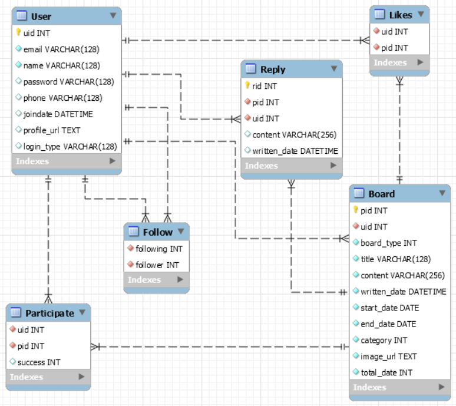


### 1) 📆 개발 진행 

> - Backend 와 Frontend로 두 팀으로 나누어 진행
>- 진행의 Work Flow는 `Jira` 를 이용해 관리
> - 버전 관리는 `Git Lab` 을 활용
>- 비대면 프로젝트 진행으로 인하여 `Matter Most` , `Webex meeting` 사용
> - 와이어 프레임의 `Adobe Xd`

- `2021-02-04` 🤦‍♂️🤦‍♀️
  - 컨설턴트님의 상담을 받고, 다시 새롭게 레이아웃과 스타일링 시도
    - UX를 더욱 고민하면서 위해 여러 탭을 줄이고,  `killing-function` 우리 팀의 핵심인 기능에 집중하기로 바꿈
    - 프로젝트 후반부에 큰 변화를 결정하게 되었다.

- 추가 사항

  - `막상 다 만들어 놓고 보니 마음에 안드는 부분이 보이기 시작한다.`
    - 사용자 경험 증진을 위한 여러가지 편의 기능들 추가
      - 한 눈에 보이고, 직감적인 네브바
      - 부가적인 레이아웃을 삭제하고, 최대한 깔끔한 디자인
      - 페이지의 색감까지 고려
  - 계속해서 찾아지는 버그들 수정

  

#### 각 side의 진행 상황

- *공통*
- 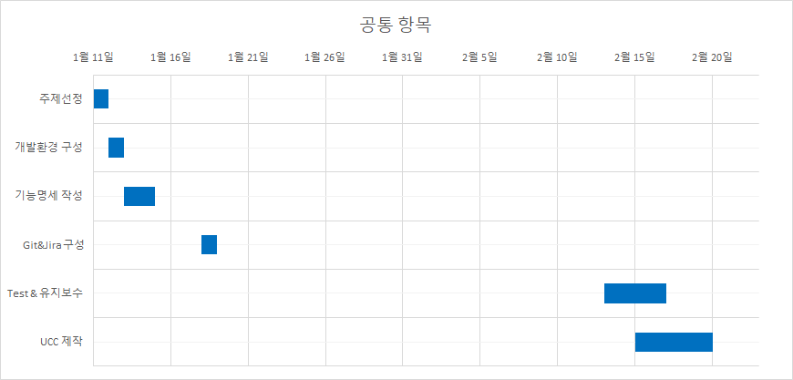


- *BACKEND*
- 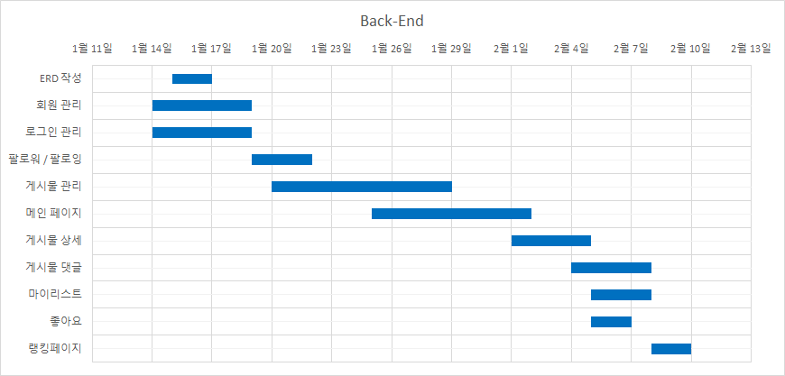


- *FRONTEND*
- 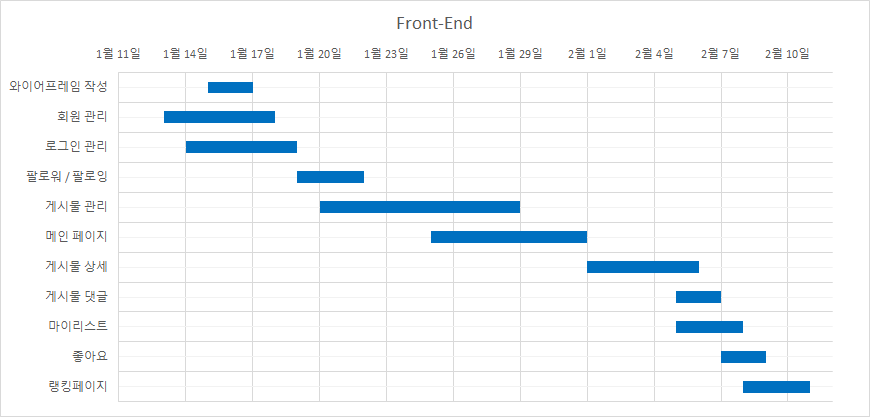


- 전체적인 프로젝트 일정

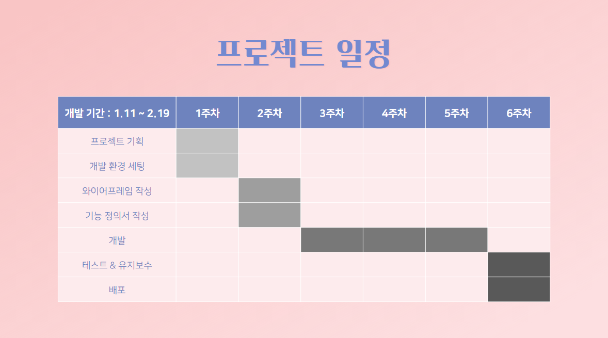


### 2) ✍🏻 기술 스택 

> 개발 환경 
>
> - AWS EC2
> - Docker
> - MySQL
> - S3 Bucket


- Frontend
  - Vue.js
  - Vuex
  - Vuetify


- Backend
  - Java (Spring Gradle)
  - MyBatis
  - MySQL


### 3) ❗ 컨벤션

- 커밋 메세지, 지라 플로우 관리에 사용
  
  - ```bash
    -  FE/ADD/feature/login & styling
    -  BE/MODIFY/feature/follow
    ```


- GIT-LAB branch naming

  - ```bash
    - FE/MODIFY/feature/following
    - BE/ADD/feature/board
    ```

    

### 🚀 구현

> 각 페이지의 화면 모습들 앞으로 변동 가능성이 있다.
>
> 아직 구현되지 않은 기능들이 있기 때문에, `2021-02-05` 기준으로 구현된 화면의 모습 


- `2021-02-05`
  - 랜딩페이지

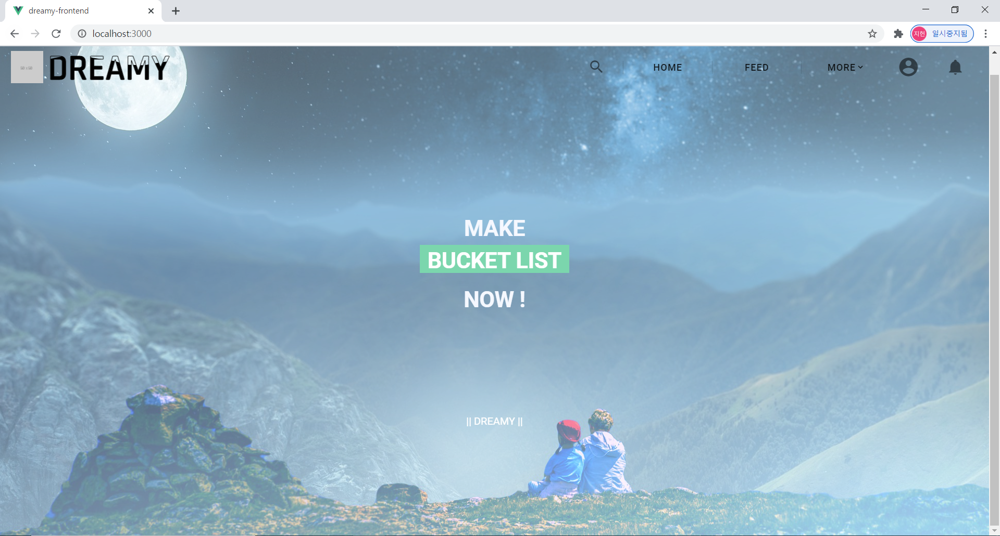


- 피드 화면

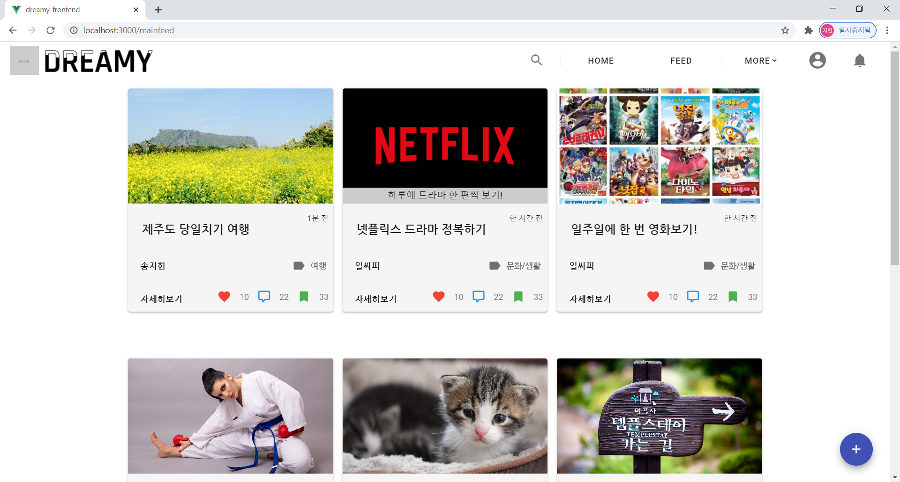


- 마이 페이지

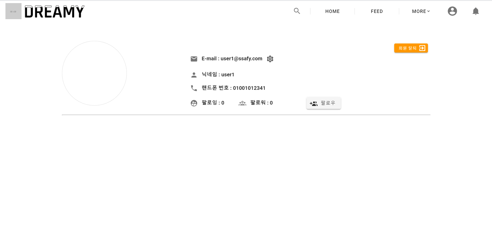

- `2021-02-18` 의 구현된 모습
  - 랜딩페이지
  - 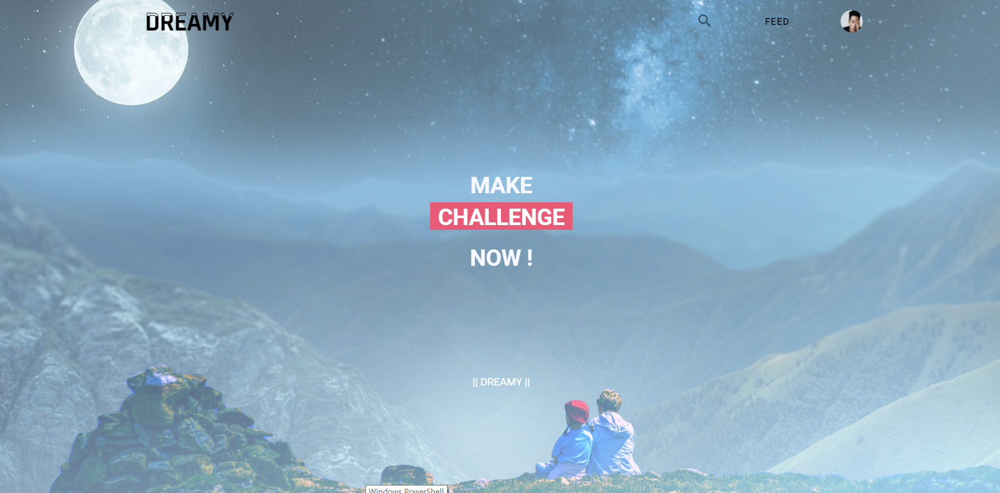

  

  - 메인페이지

    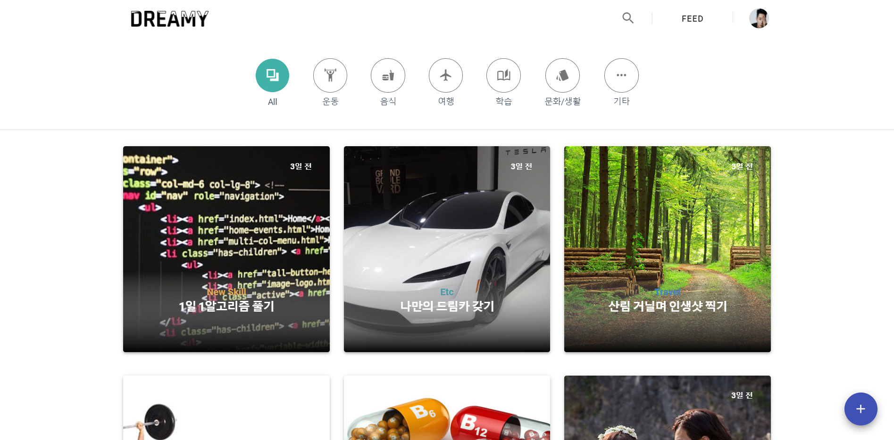

  

  - 마이 페이지
  - 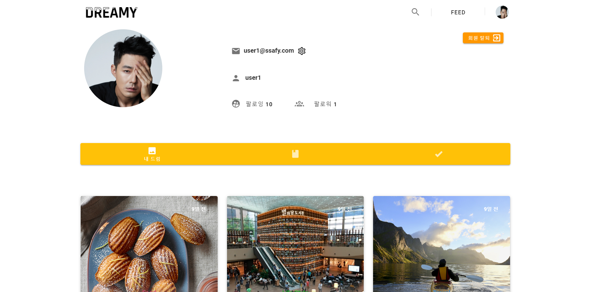


## 마무리 소감 😭

> `Dream it with DREAMY`


- 모두가 힘을 모아 만든 웹 프로젝트, 모두의 힘이 모였기에 완성할 수 있었다


- 이제 잠 좀 잘 수 있겠다.


