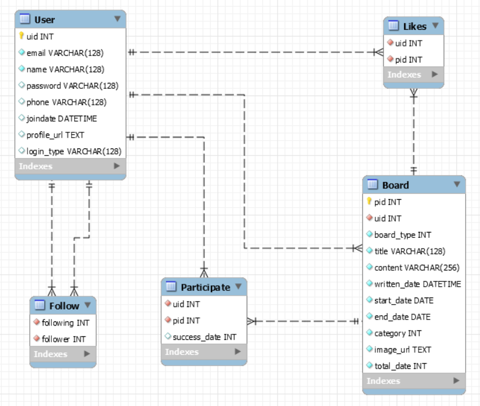

# Sub Project 3 🤞

## 발표자료
https://docs.google.com/presentation/d/1FqIpIvrmZmrvqBDAZ0215wNqT47crzIzNW5IklBbF5I/edit#slide=id.gb9495b43dd_1_719

## DREAMY  🌙

> Dream it + '드림' = 드리미; Dreamy 의 합성어
>
> 소셜 네트워크 서비스 기반으로 버킷 리스트, 챌린지를 공유, 개별 관리 기능을 제공하는 웹 서비스


### 기능

- 회원 관리

  - 회원 가입, 로그인, 로그아웃, 회원 탈퇴 가능

- 팔로우, 팔로잉

  - 취향이 비슷한 버킷 리스트, 챌린지를 게시한 사람들을 팔로우하여 소통 가능

- 버킷리스트, 챌린지 기능

  > 아무리 가벼운 계획이라도 `백지장도 맞들면 낫다`  처럼 다함께 소원 계획을 만들고, 실제 성취감을 느낄 수 있다

  - 버킷리스트

    - 말 뜻 그대로, 죽기전까지 꼭 이루고 싶은 목록의 리스트를 작성해도 되지만, 당장 오늘, 내일처럼 단기간에 계획을 적어두는 리스트처럼 이용 가능하다.

  - 챌린지

    - 계획을 세우다 보면 주기적으로 도전하고 싶은 계획들이 생긴다. 그래서 `챌린지`를 만들어 유저가 계획인 기한동안 계획한일을 트랙할 수 있다. 예) 매일 물 2L 이상 마시기..

    


### 타 서비스와 차이점

- 2021년 새해다 보니 챌린지를 개발하는 팀들이 많다.

- 드리미는 기존의 존재하는 소셜 네트워크와 챌린지의 결합
- 나만의 버킷리스트, 혹은 타 회원의 버킷리스트를 스크랩해와서 나만의 버킷리스트 제작
- 버킷리스트, 챌린지 모두 제공하면서 유저의 자유도가 높다
  - 나만의 알림장, 메모장으로도 응용 가능하기 때문


### ERD

ㄴ


### 1) 📆 개발 진행 

> - Backend 와 Frontend로 두 팀으로 나누어 진행
>- 진행의 Work Flow는 `Jira` 를 이용해 관리
> - 버전 관리는 `Git Lab` 을 활용
>- 비대면 프로젝트 진행으로 인하여 `Matter Most` , `Webex meeting` 사용
> - 와이어 프레임의 `Adobe Xd`

- `2021-02-04` 🤦‍♂️🤦‍♀️
  - 컨설턴트님의 상담을 받고, 다시 새롭게 레이아웃과 스타일링 시도
    - UX를 더욱 고민하면서 위해 여러 탭을 줄이고,  `killing-function` 우리 팀의 핵심인 기능에 집중하기로 바꿈
    - 프로젝트 후반부에 큰 변화를 결정하게 되었다.


#### 각 side의 진행 상황

- *공통*
- 


- *BACKEND*
- 


- *FRONTEND*
- 


### 2) ✍🏻 기술 스택 

> 개발 환경 
>
> - AWS EC2
> - Docker
> - MySQL
> - S3 Bucket


- Frontend
  - Vue.js
  - Vuex
  - Vuetify


- Backend
  - Java (Spring Gradle)
  - MyBatis
  - MySQL


### 3) ❗ 컨벤션

- 커밋 메세지, 지라 플로우 관리에 사용
  
  - ```bash
    -  FE/ADD/feature/login & styling
    -  BE/MODIFY/feature/follow
    ```


- GIT-LAB branch naming

  - ```bash
    - FE/MODIFY/feature/following
    - BE/ADD/feature/board
    ```

    

### 🚀 구현

> 각 페이지의 화면 모습들 앞으로 변동 가능성이 있다.
>
> 아직 구현되지 않은 기능들이 있기 때문에, `2021-02-05` 기준으로 구현된 화면의 모습 


- 랜딩페이지


- 피드 화면 


- 마이 페이지


## Sub 3 1주차 마무리 소감

> `Dream it with DREAMY`

- 인구 : 새해 복 많이(백엔드) 받으시고, 만수무강 하시고, 무병 장수 하세요~ 🧡
- 승엽 : 할건 많아지고, 프론트 개발 속도는 더뎌지고.. 💦
- 지헌 : 햄버거 먹고싶다 🍔
- 서완 : 해피 설날~ 
- 지환 : 새해 복 많이 받으세요


공통 : 갑자기 많은 부분들에 변경 사항들이 생기고, 프로젝트 기간 중간 쯤 되서야, 다른 팀들과 프로젝트 주제가 겹친다는 것을 알았기 때문에, 새롭게 주제를 정할 수 없었다. 그렇기 때문에, 주제가 겹치는 팀들이 여전히 신경쓰이는 건 사실이다. 디자인과 UX에 많은 고민과 대화를 하고 있지만, 여전히 모두가 박수 칠만한 디자인이 나오지 않는다는 것이 새삼 단순히 `이뻐보이는 것과 사용하기 편한 것`의 중심을 잡는다는 것 이 어렵다.


